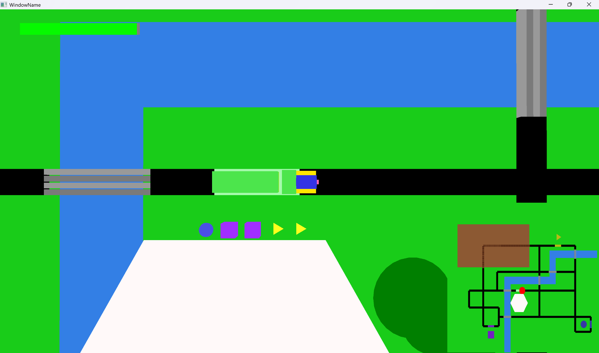
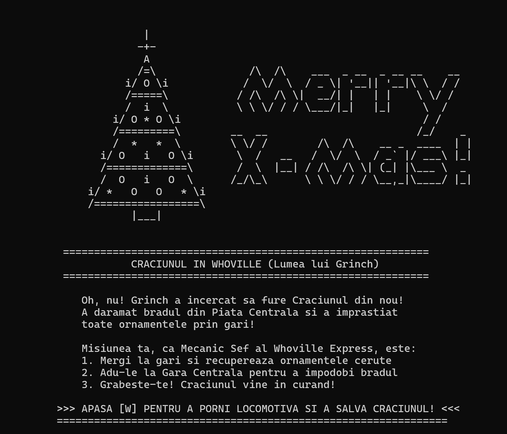
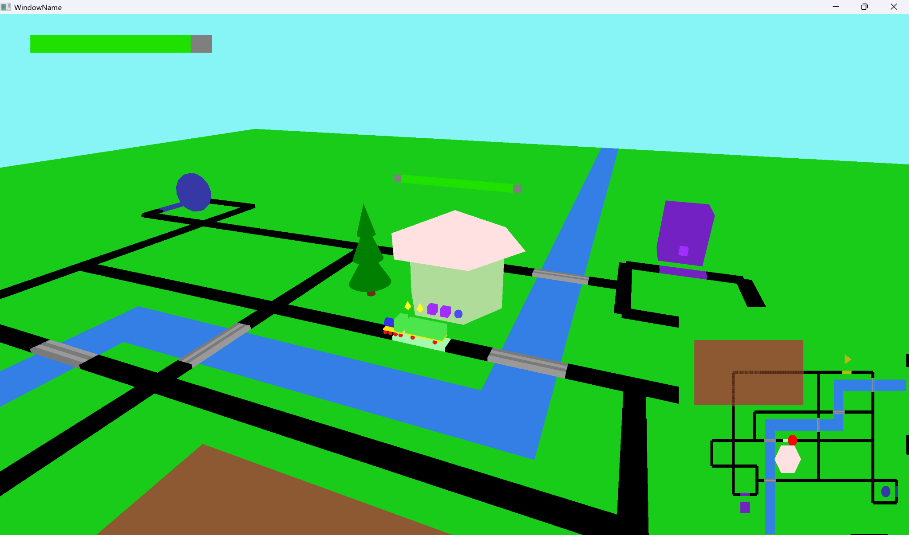
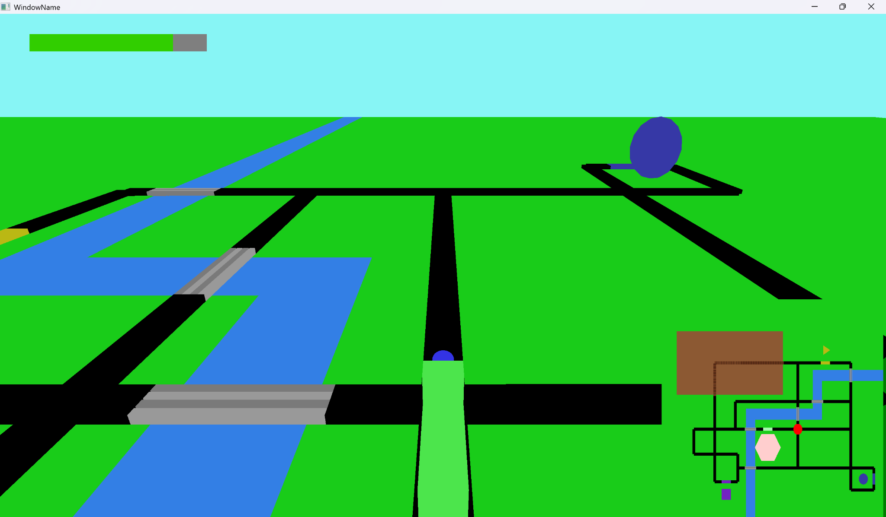
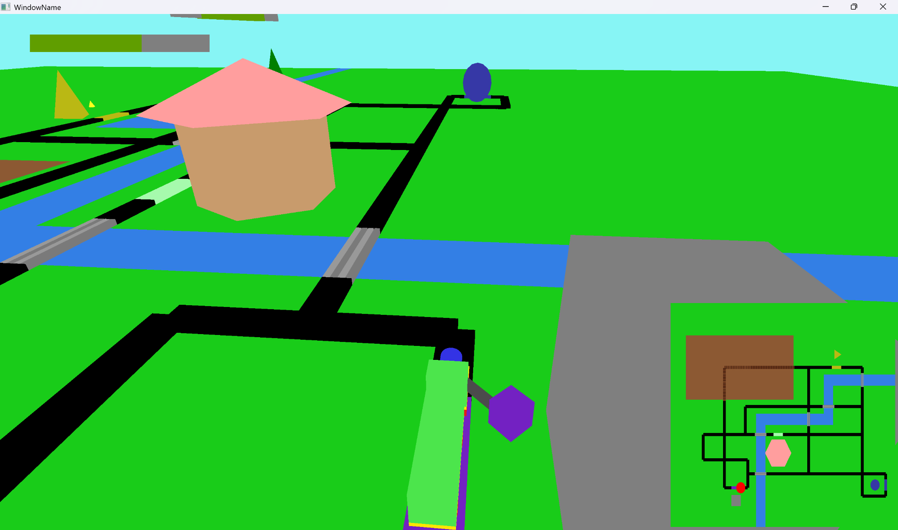
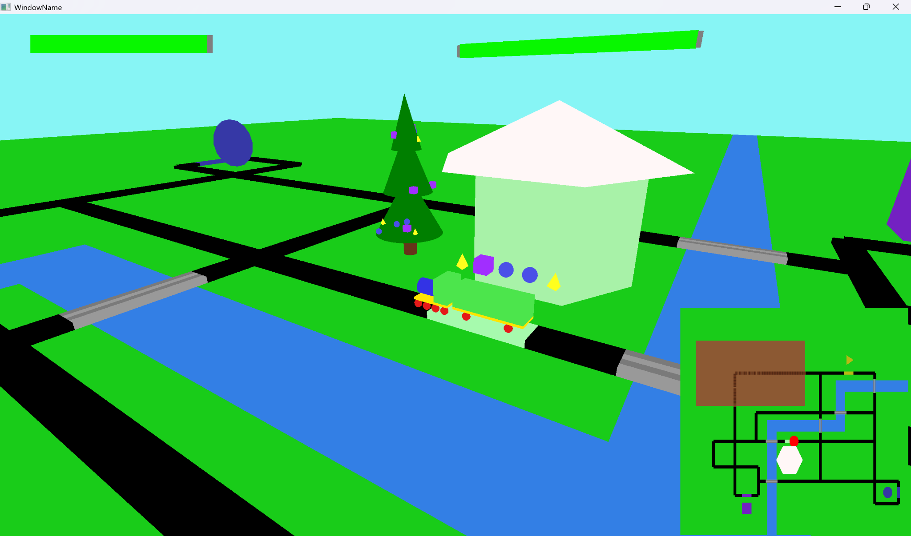
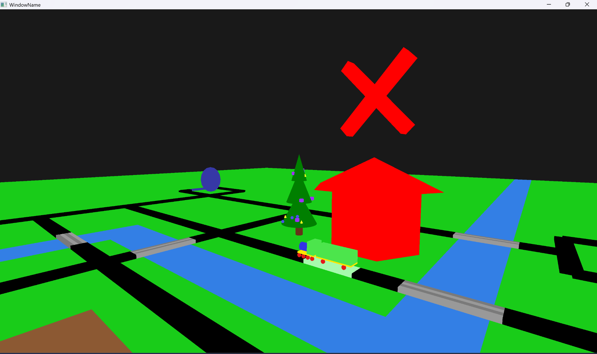
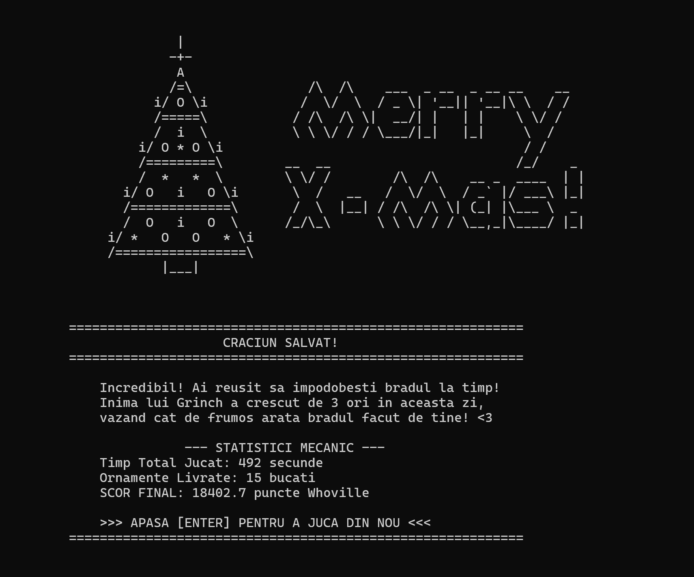

# 🎄 Cargo Delivery: Save Christmas in Whoville

## 🕹️ Overview

**Cargo Delivery: Save Christmas in Whoville** is a 3D OpenGL game built in C++, where the player controls a train tasked with saving Christmas after the Grinch sabotages the central Christmas tree.

The Grinch has scattered all ornaments across multiple stations in Whoville. Your mission is to collect them efficiently and deliver them back to the central station before time runs out.

The game focuses on **route optimization, time management, and real-time decision making** at railway intersections.

---

## 🎮 Gameplay

- Control a train moving on a railway network
- Choose directions at intersections to optimize routes
- Collect ornaments from resource stations
- Deliver them to the central station to rebuild the Christmas tree
- Complete orders as fast as possible to maximize score

### Core Mechanics

- 🚂 Train movement on rail graph
- 🔀 Intersection decision system
- 🎯 Order-based delivery system
- ⏱️ Time-based scoring
- 🔄 Resource regeneration per station
- 🎁 Dynamic order generation

---

## 📸 Screenshots

### 🎄 Start Screen

### 📊 Start Stats

### 🎮 Gameplay

### 🔀 Intersection Decision

### 🎁 Collect Ornament

### 🚚 Deliver Ornaments

### ❌ Game Over

### 📊 Game Over Stats

---

## 🧠 Technical Highlights

### 🌍 Procedural Terrain System

- The terrain is implemented as a 2D grid (matrix) where each cell represents a tile in the world
- Terrain types:
  - Grass
  - Water
  - Mountain
- Grid coordinates are automatically converted into 3D world positions
- The terrain mesh is generated manually using triangles (no external models)

---

### 🛤️ Railway System (Graph-Based)

- Rail network implemented as a **directed graph**
- Each rail stores:
  - start / end position
  - length
  - possible next rails

- Automatic connection building based on endpoints

- Rail types:
  - Normal
  - Bridge (water)
  - Tunnel (mountain)

---

### 🚂 Train System

- Movement based on:
  - rail progress `[0, 1]`
  - speed + state machine

- States:
  - moving
  - waiting at intersection
  - loading resource

- Player selects direction at intersections

---

### 🪝 Resource Collection (AABB Collision)

- Train uses a **hook mechanic**
- Hook states:
  - idle
  - extending
  - retracting

- Collision detection:
  - Axis-Aligned Bounding Box (AABB)

- On collision:
  - resource is collected
  - added to train inventory

---

### 🏗️ Custom Mesh System

All objects in the scene are procedurally generated (no external 3D models).

Implemented meshes include:
- Terrain grid
- Cylinder
- Cone
- Pyramid
- Hexagonal prism

Each object is built manually using vertices and triangles, allowing full control over geometry and appearance.
---

### 🎨 Shader System

- Custom **Vertex Shader** and **Fragment Shader**
- Handles:
  - transformations
  - coloring
  - dynamic effects

Example:
- Central station color shifts toward red as time runs out

---

### 🎥 Camera System

Two modes:

1. **Train-follow camera**
2. **Free camera (user-controlled)**

Features:
- First-person & third-person rotations
- Movement constrained on XZ plane
- Smooth camera transitions

---

### 🧭 UI / UX Features

- 🗺️ Minimap
- ⏱️ Time bar (green → red)
- 🎮 Start / End screens
- 📊 End-game statistics:
  - total time
  - delivered resources
  - score

---

### 🎯 Game Design

- 🎚️ Difficulty levels:
  - Easy / Medium / Hard

- Affects:
  - time limit
  - order complexity

- 🔄 Dynamic gameplay:
  - new orders generated after delivery
  - stations regenerate resources

---

## 🎮 Controls

| Key | Action |
|-----|--------|
| W / A / S / D | Choose direction at intersections / move camera (free mode) |
| SPACE | Toggle camera mode |
| ENTER | Restart game |
| Mouse | Control camera |

---

## ⚙️ Technologies

- C++
- OpenGL
- GLSL
- GLM
- CMake

---

## 🧩 Framework

This project is built on top of the **GFX Framework** provided by the Computer Graphics Department (UPB).

For more details, see [FRAMEWORK.md](./FRAMEWORK.md).